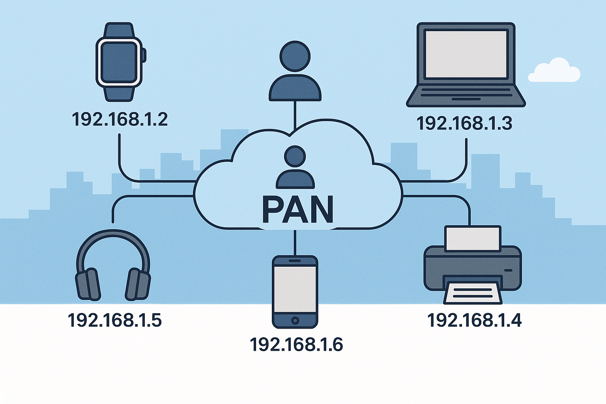
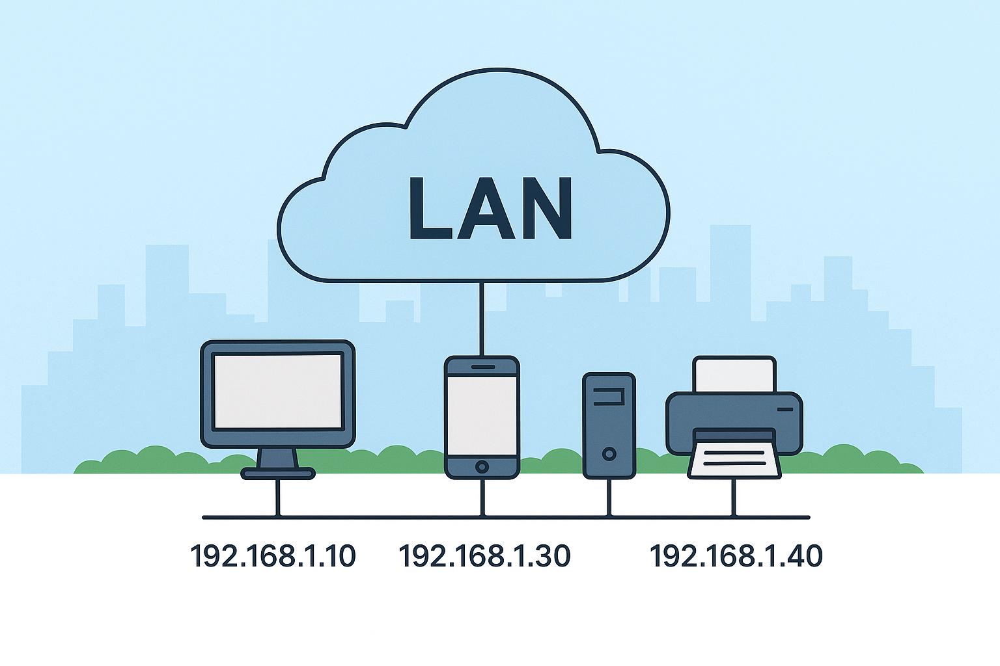
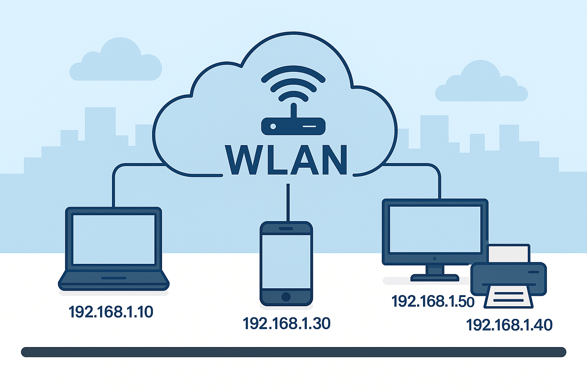
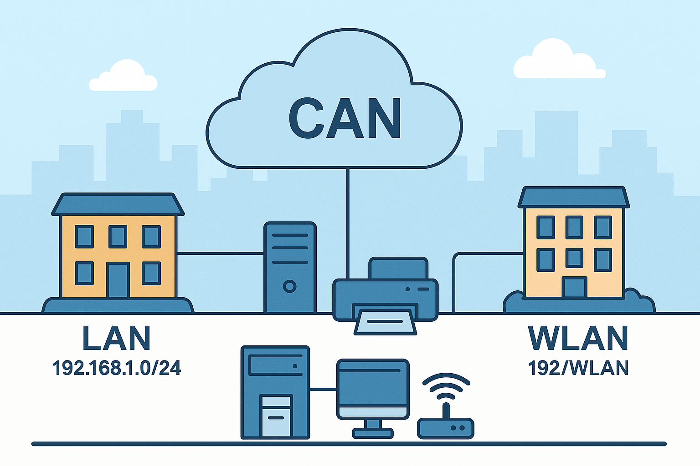
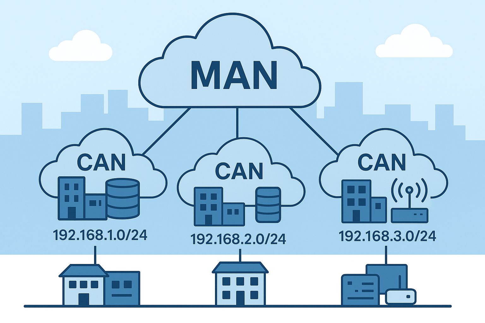
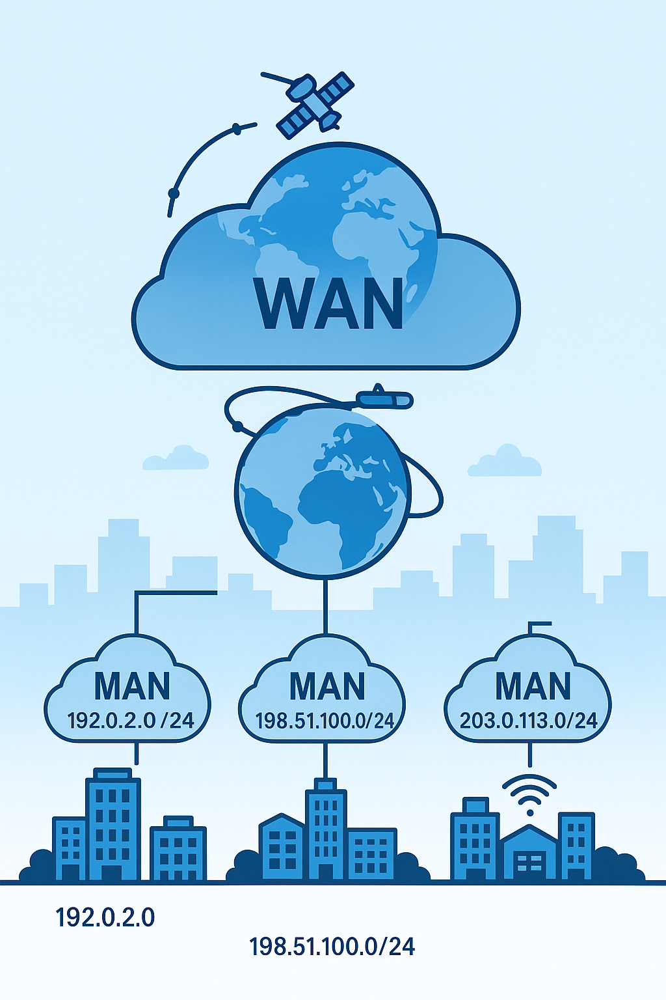
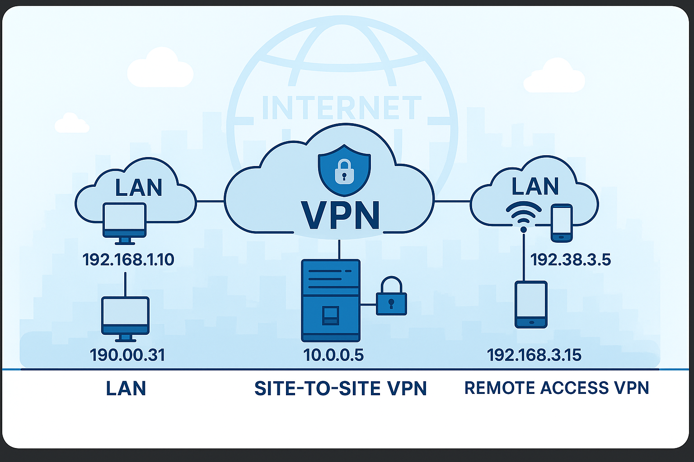
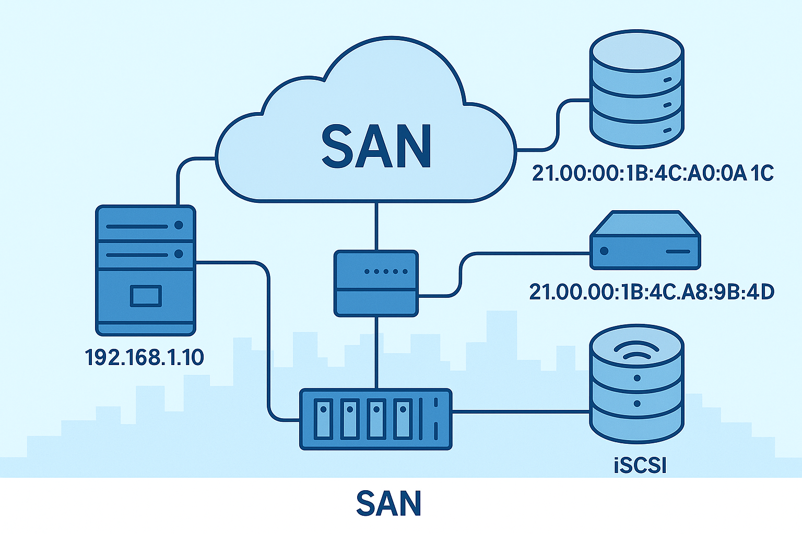

# Network Types

---
## PAN (Personal Area Network)

- **What it is**: Connects devices within a few meters
- **Range**: Very short (1-10 meters)
- **Use**: Personal device connections
- **Examples**: Bluetooth headphones, wireless keyboard
- **Technology**: Bluetooth, USB, NFC

---

## LAN (Local Area Network)

- **What it is**: Connects devices in one location (home/office)
- **Range**: Single building
- **Connection**: Wired (Ethernet) or wireless

**Key Components:**
- **Routers**: Connect networks, direct data (Layer 3)
- **Switches**: Connect devices within network (Layer 2)
- **NICs**: Connect computers to network (Layer 1)
- **Cables**: Cat5e, Cat6 for physical connections
- **Firewalls**: Protect network from threats

---

## WLAN (Wireless Local Area Network)

- **What it is**: LAN using radio waves instead of cables
- **Benefits**: Mobility, flexibility, easy expansion
- **Range**: 30-100 meters indoors

**Key Components:**
- **Access Points**: Bridge wireless to wired networks
- **Wireless Routers**: Connect wireless devices to internet
- **Wireless NICs**: Allow devices to connect wirelessly

---

## CAN (Campus Area Network)

- **What it is**: Network covering multiple buildings
- **Range**: Campus/organization grounds
- **Use**: Universities, corporate campuses, hospitals
**Key Components:**
- **Routers**: Connect networks, direct data (Layer 3)
- **Switches**: Connect devices within network (Layer 2)
- **NICs**: Connect computers to network (Layer 1)
- **Cables**: Cat5e, Cat6 for physical connections
- **Firewalls**: Protect network from threats
- **Servers**: Store and process data
- **Clients**: Access network resources
- **VPNs**: Secure connections over public networks
---

### MAN (Metropolitan Area Network)
---
- Connects networks across large distances

- **What it is**: Network covering a city or large campus
- **Range**: City or large campus   
- **Use**: Government, large corporations, schools

**Key components**: 
- **Routers**: Connect networks, direct data (Layer 3)
- **Switches**: Connect devices within network (Layer 2)
- **NICs**: Connect computers to network (Layer 1)
- **Cables**: Cat5e, Cat6 for physical connections
- **Firewalls**: Protect network from threats
- **Servers**: Store and process data
- **Clients**: Access network resources
- **VPNs**: Secure connections over public networks

## WAN (Wide Area Network)

- **What it is**: Network connecting multiple locations across large geographical areas
- **Range**: Regional, national, or global
- **Use**: Connecting branch offices, data centers, cloud services
- **Examples**: The Internet, corporate global networks, telecom backbones

**Key Characteristics:**
- **Scale**: Spans cities, countries, or continents
- **Speed**: Generally slower than LANs (though improving with fiber)
- **Ownership**: Often uses leased lines from service providers
- **Complexity**: Requires specialized routing and security

**Connection Types:**
- **Leased Lines**: Dedicated point-to-point connections
- **MPLS**: Multiprotocol Label Switching for efficient routing
- **SD-WAN**: Software-Defined WAN for flexible management
- **Broadband**: DSL, cable, fiber for smaller implementations
- **Satellite**: For remote locations without wired infrastructure

**Key Components:**
- **Edge Routers**: Connect local networks to the WAN
- **WAN Optimizers**: Improve performance over long distances
- **Load Balancers**: Distribute traffic across multiple connections
- **Security Gateways**: Provide advanced threat protection
- **VPN Concentrators**: Enable secure remote access

### VPN (Virtual Private Network)

- Secure connection over public networks
- **What it is**: Private network over public internet
- **How it works**: Encrypts data for secure transmission over public networks
- **Types**: Site-to-site, remote access, mobile VPN
- **Benefits**: Secure communication, remote access, data privacy
- **Use**: Remote work, business travel, secure data transmission
- **Components**: VPN client, server, encryption algorithms, authentication methods
- **Security**: Strong encryption, authentication, access controls

### SAN (Storage Area Network)
- Dedicated network for data storage

- **What it is**: Network for shared storage access
- **Benefits**: Improved performance, centralized storage management
- **Use**: Enterprise storage, data centers
- **Components**: Storage devices, servers, network switches, routers
- **Security**: Access controls, encryption, firewalls
